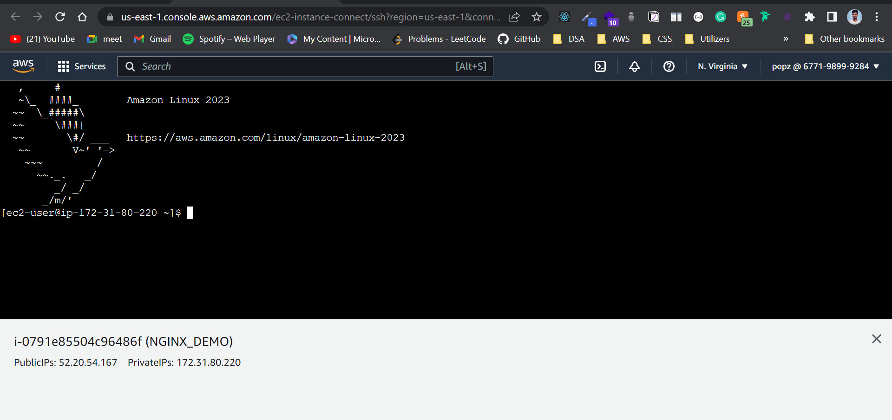

# Setting up a Node.js app on a Linux AMI on an AWS EC2 instance with Nginx

1. 



```bash
curl -o- https://raw.githubusercontent.com/creationix/nvm/v0.33.2/install.sh | bash
```


### Only after the new session


```bash
sudo yum install git
```


```bash
nvm install node
```


```bash
npm install -g pm2
```


```bash
pm2 start index.js
```


```bash
sudo yum install -y nginx
```


