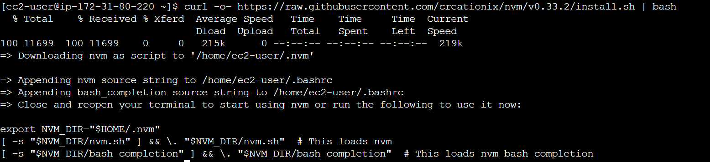

# Installing and Configuring Node.js, PM2, and NGINX on Linux

In this tutorial, we will be going through the steps to install and configure Node.js, PM2, and NGINX on a Linux system.

## Step 1: Install NVM (Node Version Manager)

```bash
curl -o- <https://raw.githubusercontent.com/creationix/nvm/v0.35.3/install.sh> | bash
```



```bash
nvm --version
```

---

## Step 2: Install Git

```bash
yum install git -y
```


## Step 3: Install Node.js using NVM

```bash
nvm install node
```

## Step 4: Clone Repo

```bash
git clone https://github.com/Sanjai-R/Nodeapp_niginx.git
```


## Step 5: Install packages


## Step 6: Install PM2

```bash
npm install pm2 -g
```

## Step 7: Start your Node.js application using PM2

```bash
pm2 start index.js
```


## Step 8: Install NGINX

```bash
sudo yum install nginx -y

```


## Step 9: Modify NGINX configuration files

```
location / {
    proxy_pass <http://localhost:3000>;
    proxy_http_version 1.1;
    proxy_set_header Upgrade $http_upgrade;
    proxy_set_header Connection 'upgrade';
    proxy_set_header Host $host;
    proxy_cache_bypass $http_upgrade;
}

```

## Step 10: Configure NGINX as a reverse proxy for your Node.js application

In the NGINX configuration file, add a server block for your Node.js application. Within this block, add the following lines:

```
location / {
    proxy_pass <http://localhost:3000>;
    proxy_http_version 1.1;
    proxy_set_header Upgrade $http_upgrade;
    proxy_set_header Connection 'upgrade';
    proxy_set_header Host $host;
    proxy_cache_bypass $http_upgrade;
}

```

Then, restart NGINX to load the new configuration:

```bash
sudo systemctl restart nginx
```


Your Node.js application should now be accessible through NGINX at your server's IP address or domain name.